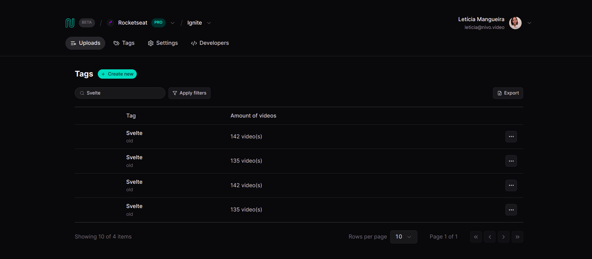

  <a href="#-tecnologias">Tecnologias</a>&nbsp;&nbsp;&nbsp;|&nbsp;&nbsp;&nbsp;
  <a href="#-projeto">Projeto</a>&nbsp;&nbsp;&nbsp;|&nbsp;&nbsp;&nbsp;
  <a href="#-como-rodar">Como rodar</a>&nbsp;&nbsp;&nbsp;|&nbsp;&nbsp;&nbsp;
  <a href="#-como-contribuir">Como contribuir</a>&nbsp;&nbsp;&nbsp;
  

 

# Data Listing

## 🚀 Tecnologias

Esse projeto foi desenvolvido com as seguintes tecnologias:

- [Nodejs](https://nodejs.org/en/) - v18.12.1
- [Pnpm](https://pnpm.io/pt/) - 8.10.5
- [Vite](https://vitejs.dev/guide/) - ^5.1.4
- [TypeScript](https://www.typescriptlang.org/) - ^5.2.2
- [Tailwindcss](https://tailwindcss.com/) - ^3.4.1
- [Tailwind-Variants](https://www.tailwind-variants.org/docs/introduction) - ^0.2.0
- [Tailwind-Merge](https://www.npmjs.com/package/tailwind-merge) - ^2.2.1
- [Radix UI](https://www.radix-ui.com/)
- [React-hook-form](https://react-hook-form.com/) - ^7.50.1
- [React-router-dom](https://reactrouter.com/en/main) - ^6.22.1
- [React Query](https://tanstack.com/query/v3/) - ^5.22.2
- [Lucide React](https://lucide.dev/guide/packages/lucide-react) - ^0.336.0
- [Zod](https://zod.dev/) - ^3.22.4

## 💻 Projeto

Projeto desenvolvido com React de um formulário que permite o cadastro de uma tag, com validação de dados e controle de estados.

- Aula feita gratuita no canal da [Rocketseat](https://www.youtube.com/@rocketseat).

  

  

  

## ⚙️ Como Rodar

- Clone o projeto.
- Entre na pasta do projeto e rode 'pnpm install' (use 'npm install' ou 'yarn add' se uma dessas for a sua configuração).
- pnpm run dev para rodar o projeto na porta indicada.
- pnpm run server para rodar a API.

## 🤔 Como contribuir

- Faça um fork desse repositório;
- Cria uma branch com a sua feature: `git checkout -b minha-feature`;
- Faça commit das suas alterações: `git commit -m 'feat: Minha nova feature'`;
- Faça push para a sua branch: `git push origin minha-feature`.

Depois que o merge da sua pull request for feito, você pode deletar a sua branch.

## 📝 Licença

Esse projeto está sob a licença MIT.
